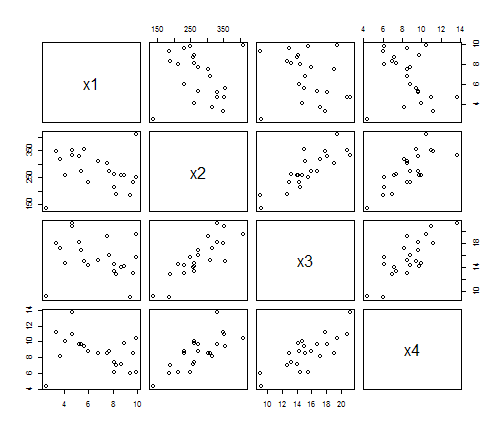

第7周 数据分析与R语言  -- 张丹(24)
========================================================
阅读作业 
请自行学习Fisher判别算法 

书面作业 
薛毅书P495第8.1、8.2题 

互动作业 
本周的互动以数学模型和算法的应用讨论为主，为后面的大作业做内容和创意储备。也可以讨论R语言的使用技巧。 
要求每位学员至少发2篇主题，1篇为我们学过的一元/多元线性及非线性回归模型、MINE算法、购物篮分析（apriori算法）、分类器等找一实际的应用场景进行讨论分析，具有直觉价值和吸引眼球的能力。根据场景所属范畴，分别发到dataguru的“行业应用案例”下的各个子版块，实在不好归类的可以发到数据分析与数据挖掘版。 
另1篇内容则着重R语言的使用方法和技巧，请发到R中国用户组版 
另外要求每位学员至少参与5个上述主题的讨论（回帖）。请大家注意，本周书面作业和网络互动视核查情况进行扣罚，请大家务必按时按质完成，谢谢。

----------------------------------
8.1题:
设明天是雨天变量为1, 非雨天变量为2


```r
library(ggplot2)
# 8.1
x1 <- c(-1.9, -6.9, 5.2, 5, 7.3, 6.8, 0.9, -12.5, 1.5, 3.8)
x2 <- c(3.2, 10.4, 2, 2.5, 0, 12.7, -15.4, -2.5, 1.3, 6.8)
d1 <- data.frame(x1, x2)

x1 <- c(0.2, -0.1, 0.4, 2.7, 2.1, -4.6, -1.7, -2.6, 2.6, -2.8)
x2 <- c(0.2, 7.5, 14.6, 8.3, 0.8, 4.3, 10.9, 13.1, 12.8, 10)
d2 <- data.frame(x1, x2)

x1 <- c(8.1)
x2 <- c(2)
d3 <- data.frame(x1, x2)
```


```r
d5 <- rbind(cbind(d1, class = 1), cbind(d2, class = 2))
p <- ggplot(d5, aes(x = x1, y = x2))
p + geom_point(aes(colour = as.character(class)))
```

 


```r
d4 <- rbind(d1, d2, d3)
source("../discriminiant.distance.R")
discriminiant.distance(d1, d2, d4)
```

```
##       1 2 3 4 5 6 7 8 9 10 11 12 13 14 15 16 17 18 19 20 21
## blong 1 1 1 1 1 1 1 1 1  1  1  2  2  1  1  1  2  2  1  2  1
```

```r

source("../discriminiant.bayes.R")
discriminiant.bayes(as.matrix(d1), as.matrix(d2), rate = 1, d4, var.equal = TRUE)
```

```
##       1 2 3 4 5 6 7 8 9 10 11 12 13 14 15 16 17 18 19 20 21
## blong 1 2 1 1 1 2 1 1 1  1  1  2  2  2  1  2  2  2  2  2  1
```

```r
discriminiant.bayes(as.matrix(d1), as.matrix(d2), rate = 1, d4, var.equal = FALSE)
```

```
##       1 2 3 4 5 6 7 8 9 10 11 12 13 14 15 16 17 18 19 20 21
## blong 2 1 1 1 1 1 1 1 2  2  2  2  2  2  1  1  2  2  2  2  1
```

```r

source("../discriminiant.fisher.R")
discriminiant.fisher(d1, d2, d4)
```

```
##       1 2 3 4 5 6 7 8 9 10 11 12 13 14 15 16 17 18 19 20 21
## blong 1 2 1 1 1 2 1 1 1  1  1  2  2  2  1  2  2  2  2  2  1
```


结论:第21个数据是测试数据, 4种情况都预测明天会下雨!!


```r
# plot(d5[1:2],xlim=c(-20,10))
# text(d5$x1,d5$x2,as.character(d5$class),adj=-0.5)
# points(d3$x1,d3$x2,col='red',cex=2)
d5 <- rbind(cbind(d1, class = 1), cbind(d2, class = 2))
p <- ggplot(d5, aes(x = x1, y = x2))
p + geom_point(aes(colour = as.character(class))) + geom_point(data = cbind(d3, 
    class = 1), color = "red", size = 4)
```

 

----------------------------------
8.2题:


```r
class <- c(rep(1, 11), rep(2, 6), rep(3, 5))
x1 <- c(8.11, 9.36, 9.85, 2.55, 6.01, 9.64, 4.11, 8.9, 7.71, 7.51, 
    8.06, 6.8, 8.68, 5.67, 3.71, 5.37, 9.89, 5.22, 4.71, 4.71, 3.36, 8.27)
x2 <- c(261.01, 185.39, 249.58, 137.13, 231.34, 231.38, 260.25, 259.91, 
    273.84, 303.59, 213.03, 308.9, 258.69, 355.54, 316.32, 274.57, 409.42, 330.34, 
    331.47, 352.5, 347.31, 189.56)
x3 <- c(13.23, 9.02, 15.61, 9.21, 14.27, 13.03, 14.72, 14.16, 16.01, 
    19.14, 14.41, 15.11, 14.02, 15.03, 17.12, 16.75, 19.47, 18.19, 21.26, 20.79, 
    17.9, 12.74)
x4 <- c(7.36, 5.99, 6.11, 4.35, 8.79, 8.53, 10.02, 9.79, 8.79, 8.53, 
    6.15, 8.49, 7.16, 9.43, 8.17, 9.67, 10.49, 9.61, 13.72, 11, 11.19, 6.94)

data <- data.frame(x1, x2, x3, x4, class)
X <- data[, 1:4]
G <- as.factor(data$class)
```


```r
plot(X)
```

 


```r
source("../distinguish.distance.R")
distinguish.distance(X, G, var.equal = TRUE)
```

```
##       1 2 3 4 5 6 7 8 9 10 11 12 13 14 15 16 17 18 19 20 21 22
## blong 2 1 1 1 1 1 3 1 1  3  1  2  1  2  2  3  2  2  3  3  3  1
```


判错7个, 错误率 7/22=32%
错误序号: 1, 7, 10, 13, 16, 18, 22 


```r
distinguish.distance(X, G, var.equal = FALSE)
```

```
##       1 2 3 4 5 6 7 8 9 10 11 12 13 14 15 16 17 18 19 20 21 22
## blong 2 1 1 1 1 1 1 1 1  1  1  2  1  2  2  1  2  2  3  3  3  3
```


判错4个, 错误率 4/22=18%
错误序号: 1, 13, 16, 18


```r
source("../distinguish.bayes.R")
distinguish.bayes(X, G, p = c(11/23, 7/23, 5/23), var.equal = TRUE)
```

```
##       1 2 3 4 5 6 7 8 9 10 11 12 13 14 15 16 17 18 19 20 21 22
## blong 1 1 1 1 1 1 1 1 1  1  1  2  1  2  2  1  2  2  3  3  2  1
```


判错5个, 错误率 5/22=23%
错误序号: 13, 16, 18, 21, 22


```r
distinguish.bayes(X, G, p = c(11/23, 7/23, 5/23), var.equal = FALSE)
```

```
##       1 2 3 4 5 6 7 8 9 10 11 12 13 14 15 16 17 18 19 20 21 22
## blong 2 1 1 1 1 1 1 1 1  1  1  2  1  2  2  1  2  2  3  3  3  1
```


判错5个, 错误率 5/22=23%
错误序号: 1, 13, 16, 18, 22

结论:通过距离判别和Bayes判别, 错误率都在20%左右非常高. 因此,说明上面数据不完全具有线性分类器特征和Bayes分类器特征!!
