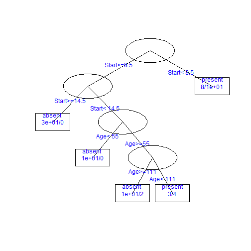
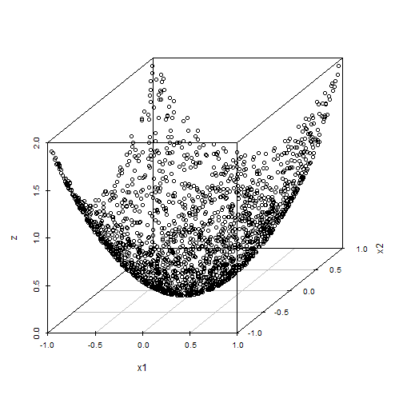
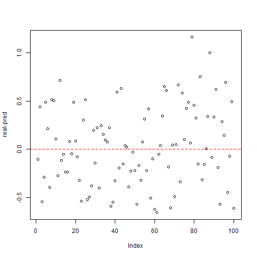

第8周 数据分析与R语言  -- 张丹(24)
========================================================
阅读作业 
自行阅读韩家炜《数据挖掘概念与技术》关于决策树算法的章节，《MATLAB神经网络30个案例分析》（dataguru搜索电子版）泛读全书 

书面作业 
1 使用rpart包建立其内置的kyphosis数据集（其内容意义可以参考rpart的介绍文档）的决策树模型，使用rpart.plot包画出该模型的决策树 
2 从函数关系y=x1^2 + x2^2 产生2000组样本数据，其中1900组作为学习集，100组作为待测集。用R语言建立合适的BP神经网络模型并利用上述学习集进行训练。然后用训练后的神经网络模型对待测集进行预测，画图对比预测值和理想值之间的误差情况 

互动作业 
本周的互动仍以数学模型和算法的应用讨论为主。 
要求每位同学至少发2篇主题，为我们学过的分类问题的线性判别法、距离判别法、贝叶斯分类器，神经网络和决策树算法等找一实际的应用场景进行讨论分析，具有直觉价值和吸引眼球的能力，也欢迎就算法的理论以及在R上的有关扩展包用法进行探讨。如果实在无法原创也可以转载讨论。根据场景所属范畴，分别发到dataguru的“行业应用案例”下的各个子版块，实在不好归类的可以发到数据分析与数据挖掘版。 
另外要求每位同学至少参与5个上述主题的讨论（回帖）。

------------------------------------------
第1题


```r
library(rpart)
rp <- rpart(Kyphosis ~ ., data = kyphosis, method = "class")
plot(rp, uniform = TRUE, branch = 0, margin = 0.1)
text(rp, use.n = TRUE, fancy = TRUE, col = "blue")
```

 

```r
print(rp)
```

```
## n= 81 
## 
## node), split, n, loss, yval, (yprob)
##       * denotes terminal node
## 
##  1) root 81 17 absent (0.79012 0.20988)  
##    2) Start>=8.5 62  6 absent (0.90323 0.09677)  
##      4) Start>=14.5 29  0 absent (1.00000 0.00000) *
##      5) Start< 14.5 33  6 absent (0.81818 0.18182)  
##       10) Age< 55 12  0 absent (1.00000 0.00000) *
##       11) Age>=55 21  6 absent (0.71429 0.28571)  
##         22) Age>=111 14  2 absent (0.85714 0.14286) *
##         23) Age< 111 7  3 present (0.42857 0.57143) *
##    3) Start< 8.5 19  8 present (0.42105 0.57895) *
```


-------------------------------------------
第2题


```r
x1 = (sample(seq(-1, 1, length = 2200), 2000, replace = FALSE))
x2 = (sample(seq(-1, 1, length = 2200), 2000, replace = FALSE))
target <- x1^2 + x2^2
p <- cbind(x1, x2)

library(AMORE)
library(scatterplot3d)
neurons <- newff(n.neurons = c(2, 6, 4, 1), learning.rate.global = 0.01, 
    momentum.global = 0.5, error.criterium = "LMS", Stao = NA, hidden.layer = "sigmoid", 
    output.layer = "sigmoid", method = "ADAPTgd")
```


y= x1^2 + x2^2 的三维坐标图形


```r
scatterplot3d(x1, x2, target, xlab = "x1", ylab = "x2", zlab = "z")
```

 

```r
result <- train(neurons, p[1:1900], target[1:1900], error.criterium = "LMS", 
    report = TRUE, show.step = 100, n.shows = 5)
```

```
## index.show: 1 LMS 0.184149658597514 
## index.show: 2 LMS 0.184149972761092 
## index.show: 3 LMS 0.184150295454073 
## index.show: 4 LMS 0.18415062613943 
## index.show: 5 LMS 0.184150964231117 
```

```r

z <- sim(result$net, p[1901:2000])
real <- cbind(p[1901:2000, ], z = target[1901:2000])
pred <- -cbind(p[1901:2000, ], z = z)
data <- rbind(real, pred)

color <- c(rep("green", 100), rep("red", 100))
```


对索引为1901到2000的数据，进行实际值和预测值的显示
绿色为实际值，红色为预测值

下图显示，两种色的点，几乎没有交集，因此预测的效果很不好！


```r
scatterplot3d(data[, 1], data[, 2], data[, 3], color, xlab = "x1", 
    ylab = "x2", zlab = "z")
```

 


下图显示，实际值－预测值的差值，为０就是拟合的，非０为不拟合！


```r
d <- target[1901:2000] - z
plot(d, ylab = "real-pred")
abline(h = 0, col = "red", lty = 2)
```

 


--------------------------------------------------
第3题，knn的R语言实现


